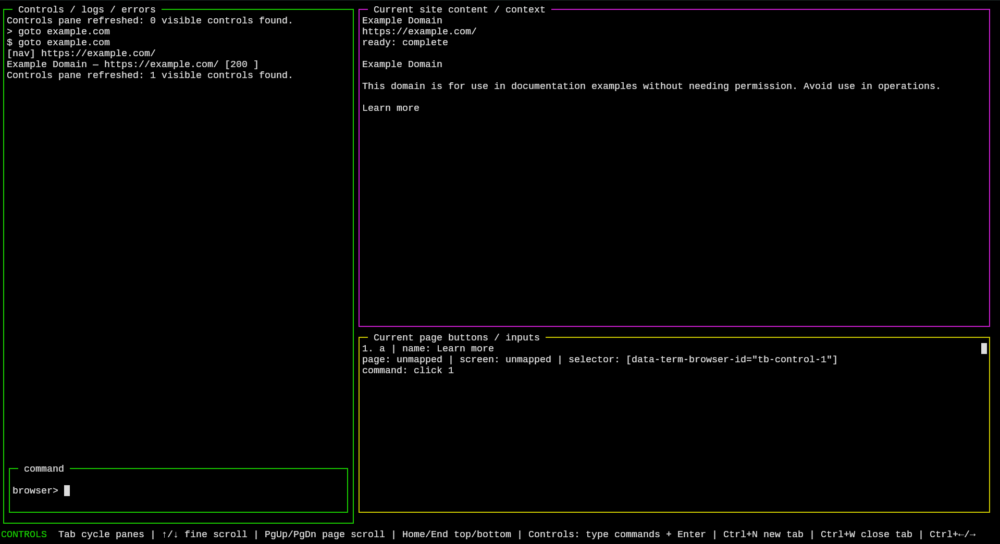
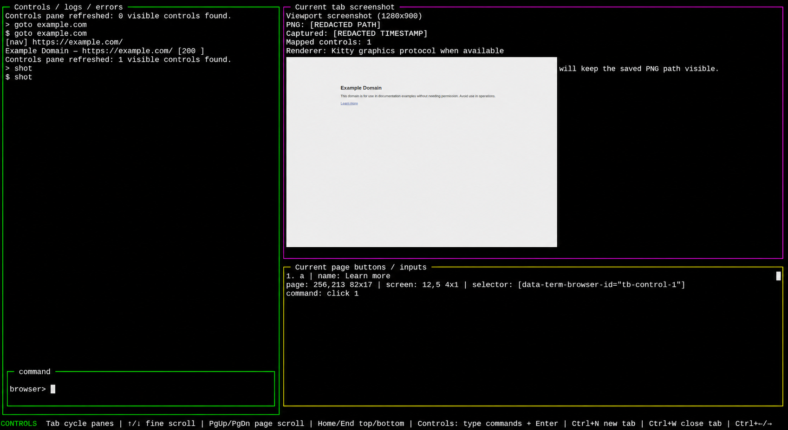

# BrowserUse — VibeChat POC

**Use a real browser from your terminal with Playwright.**

BrowserUse is a terminal browser controller built with Playwright and Blessed as a proof of concept for [VibeChat](https://github.com/angdwww/VibeChat). It shows how a real working local code project can be built, debugged, tested, documented, cleaned, and published through structured VibeChat operations.

VibeChat repo: https://github.com/angdwww/VibeChat

## Demo

### Context view with mapped page controls



### Shot mode with browser screenshot rendering



## Why this exists

Browser automation usually forces you to choose between a full visual browser or writing scripts without seeing what is happening. BrowserUse explores a middle path: a terminal-native interface where developers can inspect, navigate, and control a real browser from the CLI.

It is also a practical proof that VibeChat can drive real software development work. This repo was built through iterative VibeChat JSON operation blocks that edited files, ran shell commands, fixed bugs, executed smoke tests, cleaned the repository, and pushed to GitHub.

## What BrowserUse does

BrowserUse gives you a command-driven terminal UI for controlling a real browser session.

Feature highlights:

- **Playwright browser control** for loading and interacting with real web pages.
- **Terminal TUI layout** with panes for logs, page context, controls, and command input.
- **Command workflow** for navigation, clicking, typing, scrolling, waiting, screenshots, and page inspection.
- **Readable context view** showing page title, URL, readiness state, text, and extracted content.
- **Numbered controls pane** that maps visible links, buttons, and inputs into terminal actions.
- **Click-by-number interaction** with commands like `click 1`.
- **Input-by-number typing** for detected fields and controls.
- **Shot mode** that captures the browser viewport and renders the screenshot inside the terminal.
- **Mapped screenshot coordinates** for connecting terminal hover/click positions back to browser viewport coordinates.
- **Kitty graphics support** for the best image rendering experience.
- **Terminal mouse support** for hover, click, pane interaction, and scrolling.
- **Tab management** for opening, switching, and closing browser tabs.
- **Smoke test mode** for quick regression checks.
- **Classic CLI entrypoint** alongside the newer TUI entrypoint.

## Quick Start

```bash
git clone https://github.com/angdwww/BrowserUse-VibeChatPOC.git
cd BrowserUse-VibeChatPOC
npm install
npm run setup:browsers
npm run check
npm run smoke
npm run start
```

The smoke test should end with:

```text
Smoke test passed
```

## Best terminal

Use **Kitty Terminal** for the best experience.

BrowserUse uses terminal mouse events, alternate-screen rendering, pane scrolling, and terminal image display. Kitty provides the best experience for shot mode because it supports the Kitty graphics protocol.

Recommended:

```bash
kitty
```

Then run BrowserUse inside Kitty.

## Requirements

- Node.js 20 or newer
- npm
- Playwright Chromium browser install
- Kitty Terminal recommended

Main dependencies:

- `playwright`
- `blessed`
- `pngjs`

## Running

Start the TUI:

```bash
npm run start
```

or:

```bash
npm run tui
```

Run the classic CLI:

```bash
npm run classic
```

Run syntax checks:

```bash
npm run check
```

Run the smoke test:

```bash
npm run smoke
```

## Common commands

Inside the TUI:

```text
goto example.com
context
links
buttons
inputs
click 1
type 1 hello
press Enter
shot
image
screenshot
scroll down
scroll up
help
```

Useful command patterns:

```text
goto google.com
inputs
type 1 browser automation
press Enter
```

```text
buttons
click 1
```

```text
shot
clickxy 250 200
```

`help` inside the app shows the full command list.

## Interface layout

BrowserUse is split into four main terminal areas:

- **Controls / logs / errors**: command history, navigation logs, status messages, and browser action feedback.
- **Current site content / context**: readable page output, screenshot view, and page-level context.
- **Current page buttons / inputs**: numbered browser controls that can be acted on from the command line.
- **Command box**: the prompt where browser commands are entered.

## Numbered page controls

BrowserUse maps browser elements to terminal actions. For example, a page link can appear as:

```text
1. a | name: Learn more
page: 256,213 82x17 | selector: [data-term-browser-id="tb-control-1"]
command: click 1
```

That lets you use:

```text
click 1
```

instead of manually building selectors.

## Screenshot / shot mode

Shot mode captures the current browser viewport, stores a screenshot, displays it in the terminal, and maps screenshot coordinates back to browser coordinates.

In Kitty, BrowserUse can display the screenshot directly inside the terminal while keeping mapped controls visible in the controls pane.

## How VibeChat was used

BrowserUse was created through a VibeChat local development loop:

1. The project folder was opened locally.
2. ChatGPT generated structured VibeChat JSON operation blocks.
3. VibeChat executed file writes, patches, shell commands, syntax checks, smoke tests, Git commits, and GitHub commands.
4. The command results were pasted back into the chat.
5. The repo was improved step by step until it had a working TUI, screenshots, documentation, privacy cleanup, and a GitHub-ready structure.

This makes BrowserUse a concrete demonstration of VibeChat as a practical local development workflow.

## Roadmap

See [`docs/ROADMAP.md`](docs/ROADMAP.md).

## Contributing

See [`CONTRIBUTING.md`](CONTRIBUTING.md).

Good first contribution areas:

- Improve docs and examples.
- Add more smoke test coverage.
- Improve shot-mode controls and calibration.
- Add configuration options.
- Create a short demo GIF or launch video.

## Security

See [`SECURITY.md`](SECURITY.md).

## Repository structure

```text
bin/
  term-browser-tui.js      Main BrowserUse TUI proof of concept
  term-browser.js          Classic CLI entrypoint
docs/
  assets/                  README screenshots
  ARCHITECTURE.md          Project architecture notes
  PRIVACY_CHECKLIST.md     Repo cleaning and privacy checklist
  ROADMAP.md               Planned improvements
.github/
  ISSUE_TEMPLATE/          Starter issue templates
package.json              Node scripts and dependencies
README.md                 Project overview and setup guide
```

## License

MIT. See [`LICENSE`](LICENSE).
